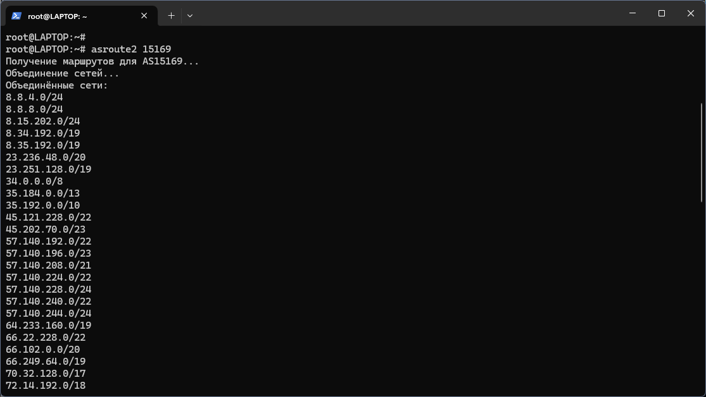

# ASROUTE2 - Fetch &amp; Merge Autonomous System Networks

**asroute2** is a tool for fetching and merging Autonomous System (AS) routes. It allows you to extract routes from WHOIS databases, merge close networks, and filter nested subnets for analysis or other tasks.

## Features
- Fetch routes for a specified AS number from whois.radb.net.
- Merge networks based on a specified tolerance.
- Filter out nested subnets.

If you work with Autonomous Systems, asroute2 simplifies your workflow.

---

## Installation

### 1. Clone the Repository
Download the repository:
```bash
git clone https://github.com/mnbarinov/asroute2.git
cd asroute2
# Create a symbolic link to use asroute2 as a command:
sudo ln -s $(pwd)/asroute2.py /usr/local/bin/asroute2
```
### 2. Install Dependencies

asroute2 requires Python 3.6+ and the whois utility. Install them if they are not already installed:
```
# For Debian/Ubuntu
sudo apt install whois python3
```
For other distributions, use the package manager for your system.

## Usage
Basic Command
```
asroute2 <AS_NUMBER> [--tolerance <TOLERANCE>]
```
### Parameters:
- <AS_NUMBER>: The Autonomous System number (e.g., 15169).
- --tolerance (optional): The allowed number of skipped networks for merging. Default: 0.

### Examples
#### Fetch routes for AS 15169 (Google):
```
asroute2 15169
```
#### Fetch routes with tolerance for merging:
```
asroute2 15169 --tolerance 8
```
#### Display help:
```
asroute2 --help
```
### Screenshot:


## Additional Tools
We recommend using asroute2 alongside [aslookup](https://github.com/mnbarinov/as-number-lookup-by-ip), a tool for finding AS numbers based on IP addresses.

## Author
Developed by [Mikhail Barinov](https://github.com/mnbarinov).
## 

